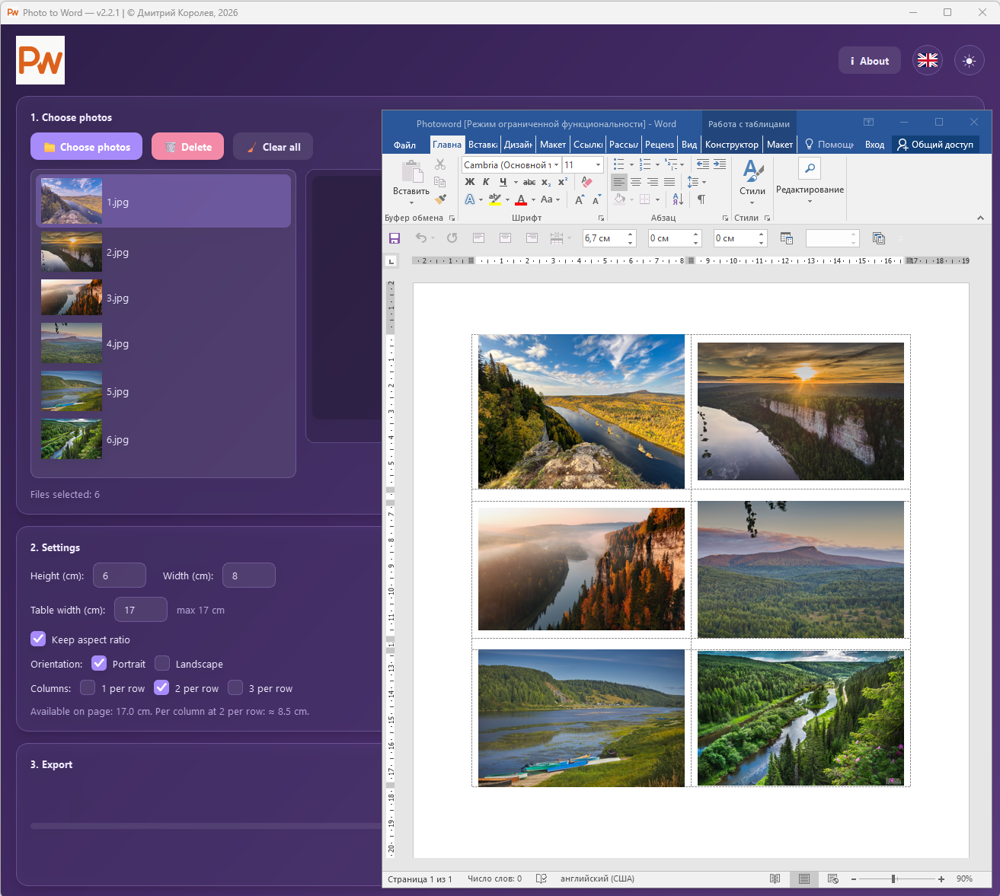
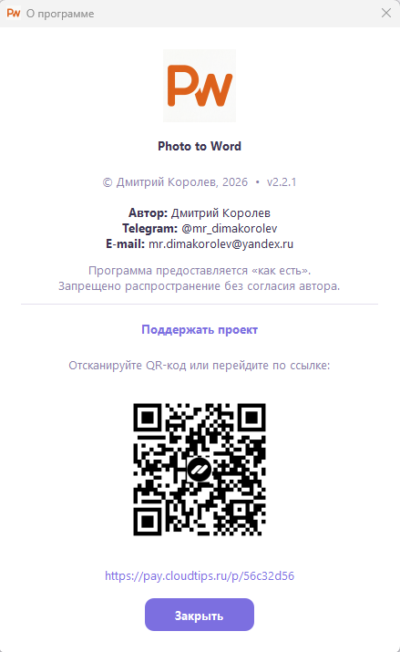

# 📸 Photo to Word

[](https://opensource.org/licenses/MIT)
[](https://www.python.org/)
[](https://pypi.org/project/PySide6/)
[]()
[]()

**Photo to Word** — десктопное приложение, которое превращает папку с фотографиями в аккуратно оформленный документ Word за один клик.

Создано для оценщиков, риелторов, страховых агентов, экспертов, фотографов — всех, кто регулярно формирует фотоотчёты.


---

## ✨ Возможности

- 📁 **Загрузка фото** — через диалог или перетаскиванием (drag-and-drop)
- 🖼️ **Сетка 1–3 колонки** — книжная или альбомная ориентация страницы
- 🔄 **Поворот фото** и сортировка в списке
- 📐 **Точные размеры** — высота, ширина, ширина таблицы
- 🎨 **Светлая и тёмная темы** с сохранением выбора
- 🌍 **Русский и английский** интерфейс
- 📱 **Адаптивный интерфейс** — корректно работает на любом разрешении
- 🔒 **Полностью офлайн** — никаких облаков, телеметрии и подписок

---

## 🖼️ Скриншоты

| Светлая тема | Тёмная тема |
|---|---|
|  |  |

| Превью и управление | О программе |
|---|---|
|  |  |

---

## 🚀 Быстрый старт

### Вариант 1. Готовый `.exe` (Windows)

1. Перейдите в раздел [**Releases**](../../releases).
2. Скачайте `PhotoToWord.exe` последней версии.
3. Запустите — установка не требуется.

### Вариант 2. Запуск из исходников

```bash
# 1. Клонируйте репозиторий
git clone https://github.com/MRDIMAKO/photo-to-word.git
cd photo-to-word

# 2. Установите зависимости
pip install -r requirements.txt

# 3. Запустите
python photoword.py
```

### Вариант 3. Сборка собственного `.exe`

```bash
pip install pyinstaller
pyinstaller photoword.spec
```

Готовый файл появится в папке `dist/PhotoToWord.exe`.

---

## 🛠️ Технологии

- **Python 3.10+**
- **PySide6** — GUI (Qt for Python)
- **python-docx** — генерация Word-документов
- **Pillow** — работа с изображениями
- **PyInstaller** — сборка автономного `.exe`

---

## 📖 Как пользоваться

1. **Выберите фотографии** — кнопкой «📁 Выбрать фото» или перетащите их в окно.
2. **Отсортируйте и поверните** — кнопки «⬆ Вверх», «⬇ Вниз», «↺».
3. **Настройте параметры**:
   - Высота и ширина каждой фотографии в см (Если установлен параметр "Сохранять пропорции", то достаточно только настроить высоту).
   - Ширина таблицы (рекомендуется макс. 17 см для книжной, 26 см для альбомной).
   - Ориентация страницы и число колонок.
4. **Нажмите «📄 Создать документ Word»** — выберите путь сохранения.
5. Документ **автоматически откроется** — можно сразу отправлять.

---

## 📋 Системные требования

- **ОС**: Windows 10/11
- **ОЗУ**: от 2 ГБ
- **Свободное место**: ~100 МБ (готовый exe) / ~150 МБ (Python-окружение)
- **Разрешение экрана**: от 1920×1080

---

## 🤝 Участие в разработке

Проект открыт для предложений и улучшений.

- 🐛 Нашли баг? [Создайте issue](../../issues).
- 💡 Есть идея? [Опишите её](../../issues).
- 🔧 Хотите внести код? Форкните репозиторий и создайте pull request.

### Планы на будущее

- [ ] PDF-экспорт
- [ ] Автоопределение ориентации
- [ ] Шаблоны компоновки (фото + подпись)
- [ ] Пакетная обработка папок

---

## ❤️ Поддержать проект

Если программа экономит вам время — поддержите разработку:

- **CloudTips**: [https://pay.cloudtips.ru/p/56c32d56](https://pay.cloudtips.ru/p/56c32d56)
- Внутри приложения: раздел **«О программе»** → QR-код

Любая сумма и/или даже доброе слово — это сигнал, что такие утилиты нужны.

---

## 📜 Лицензия

Распространяется под лицензией **MIT**. См. файл [LICENSE](LICENSE).

---

## 👤 Автор

**Дмитрий Королев**

- Telegram: [@mr_dimakorolev](https://t.me/mr_dimakorolev)
- E-mail: mr.dimakorolev@yandex.ru

---

⭐ Если проект оказался полезным — поставьте звезду. Это лучший способ сказать «спасибо» и помочь другим найти утилиту.
